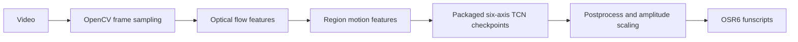

# OSRGen Architecture

[English](#english) | [中文简体](#中文简体) | [日本語](#日本語)

## English

This repository is the runtime release for generating OSR6/SR6 funscripts from videos.

### Runtime Modules

- `video.py`: video metadata and grayscale frame sampling.
- `flow.py`: global ROI optical-flow statistics.
- `regions.py`: fixed candidate-region optical-flow features.
- `modeling.py`: checkpoint loading, feature matrix construction, six-axis prediction, funscript writing.
- `batch_predict.py`: folder batch generation and lightweight QC summaries.
- `preset_validation.py`: resource and runtime checks before long jobs.
- `gui.py`: Windows GUI, language switching, queue handling, output modes.

### Release Contents

- Six-axis checkpoints: `models/region_all_profile_95_e20/`
- Default preset: `configs/presets/region_hybrid_experience_95.json`
- Postprocess profile: `configs/postprocess/region_all_quality_95.json`
- GUI, CLI, runtime code, and runtime tests

## 中文简体

这个仓库是用于从视频生成 OSR6/SR6 funscript 的运行发布版。

### 运行模块

- `video.py`：视频元信息和灰度抽帧。
- `flow.py`：全局 ROI 光流统计。
- `regions.py`：固定候选区域光流特征。
- `modeling.py`：加载 checkpoint、补齐特征列、执行六轴推理、写出 funscript。
- `batch_predict.py`：文件夹批量生成和轻量 QC 汇总。
- `preset_validation.py`：加载模型和 profile，提前发现缺文件或维度不一致。
- `gui.py`：Windows 图形界面和输出模式管理。

### 发布内容

- 六轴 checkpoint：`models/region_all_profile_95_e20/`
- 默认 preset：`configs/presets/region_hybrid_experience_95.json`
- 后处理 profile：`configs/postprocess/region_all_quality_95.json`
- GUI、CLI、推理代码和测试

## 日本語

このリポジトリは動画から OSR6/SR6 funscript を生成するための実行版です。

### 実行モジュール

- `video.py`: 動画メタデータとグレースケールフレームのサンプリング。
- `flow.py`: グローバル ROI の光フロー統計。
- `regions.py`: 固定候補領域の光フロー特徴。
- `modeling.py`: checkpoint 読み込み、特徴行列作成、六軸推論、funscript 出力。
- `batch_predict.py`: フォルダー一括生成と軽量 QC サマリー。
- `preset_validation.py`: 長い処理の前にモデルと profile を検証。
- `gui.py`: Windows GUI、言語切り替え、キュー処理、出力モード。

### 含まれるもの

- 六軸 checkpoint: `models/region_all_profile_95_e20/`
- 既定 preset: `configs/presets/region_hybrid_experience_95.json`
- 後処理 profile: `configs/postprocess/region_all_quality_95.json`
- GUI、CLI、推論コード、実行版テスト
